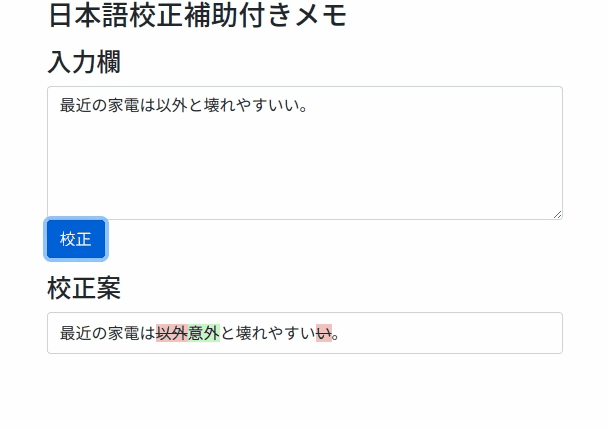

# 日本語校正付きメモ



## 利用方法

### 手元に環境を作る場合

Python環境の準備

```
$ python3 -m venv .venv
$ . .venv/bin/activate
$ pip install --upgrade pip wheel
# 公式サイトの案内に従い、環境に合ったバージョンのPyTorchをインストールしてください
$ pip install torch torchvision torchaudio --extra-index-url https://download.pytorch.org/whl/cu116
$ pip install -r requirements.txt
```

パラメータファイルを[Google Drive](https://drive.google.com/file/d/1C6ciKX3wkWMBuaEIjAMKpZKs3m2Pmw3d/view?usp=sharing)からダウンロードし、`models/`以下に置く

Webアプリケーションの起動

```
$ python web.py
```

http://localhost:9310 にアクセスして利用する。

### Dockerを使用する場合

あとで書く

### 学習から行う場合

Python環境の準備の後、データをダウンロードして学習する。

```
$ cd data
$ wget "https://nlp.ist.i.kyoto-u.ac.jp/DLcounter/lime.cgi?down=https://nlp.ist.i.kyoto-u.ac.jp/nl-resource/JWTD/jwtd_v2.0.tar.gz&name=JWTDv2.0.tar.gz"
$ tar xzf JWTDv2.0.tar.gz
$ cd ..
$ python preprocess.py
$ python train.py 2
```

学習後に表示されるファイル名を`models/v0.2.0.ckpt`にリネームして利用する。

## License

CC-BY-SA 3.0

* 日本語校正のベースモデルとして、[東北大学乾研究室](https://www.nlp.ecei.tohoku.ac.jp/)により作成された学習済みBERTモデル[cl-tohoku/bert-base-japanese-v2](https://huggingface.co/cl-tohoku/bert-base-japanese-v2)を使用しています。
* 校正の学習データとして、[京都大学黒橋・褚・村脇研究室](https://nlp.ist.i.kyoto-u.ac.jp/)により作成された[日本語Wikipedia入力誤りデータセット (v2)](https://nlp.ist.i.kyoto-u.ac.jp/?%E6%97%A5%E6%9C%AC%E8%AA%9EWikipedia%E5%85%A5%E5%8A%9B%E8%AA%A4%E3%82%8A%E3%83%87%E3%83%BC%E3%82%BF%E3%82%BB%E3%83%83%E3%83%88)を使用しています。
